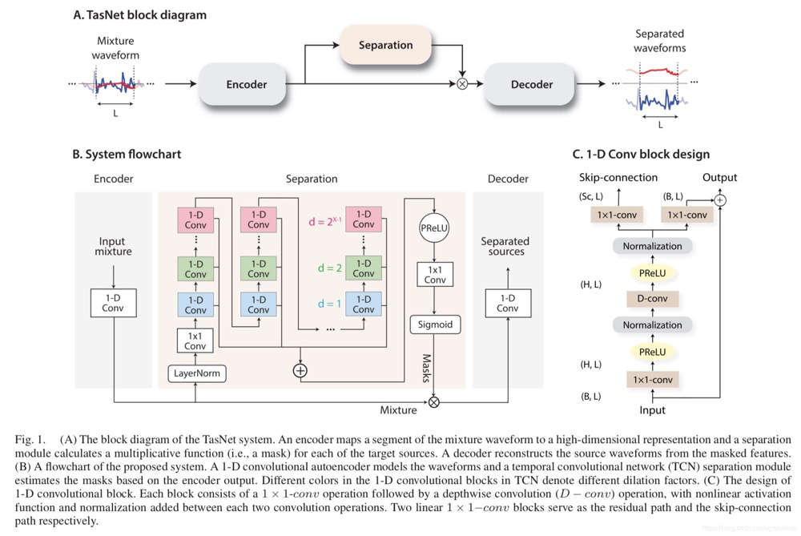
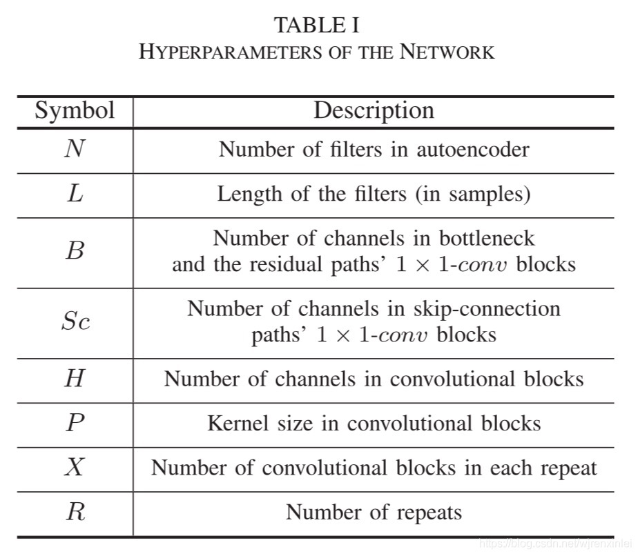
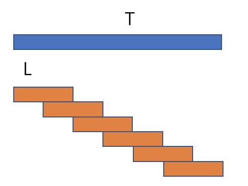
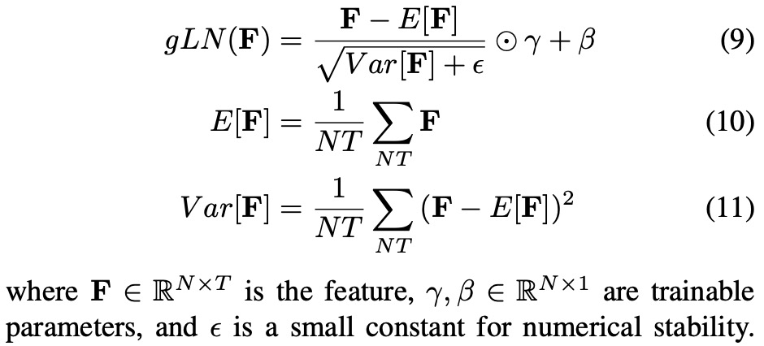
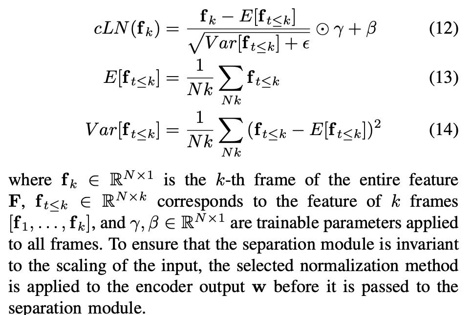

## Abstract

作者提出了一种全卷积时域音频分离网络 Conv-TasNet，这是一种端到端的时域语音分离的深度学习框架。Conv-TasNet 使用线性编码器生成语音波形的表示形式，并针对单个说话人的分离进行了优化。然后将一组加权函数（掩码）应用于编码器的输出来实现说话人分离。最后使用线性解码器得到分离出的语音波形。使用由一维膨胀卷积块组成的时域卷积网络计算掩码，这使得网络可以对语音信号的长期依赖性进行建模，同时保持较小的模型尺寸。

## 模型结构

全卷积时域音频分离网络（Conv-TasNet）由三个处理阶段组成，如图1(A) 所示：编码器，分离和解码器。 首先，编码器模块将混合信号的短片段转换为中间特征空间中的相应表示。 然后，使用该表示来估计每个源的乘法函数（掩码）。 最后，解码器模块通过转换掩蔽之后的编码器特征来重建源波形。



## 模型参数



## 代码学习

https://github.com/kaituoxu/Conv-TasNet/

首先按照模型结构，对应构建模型类，编码器，分离（TCN模块）和解码器类：

```python
class ConvTasNet(nn.Module):
    ...

class Encoder(nn.Module):
    ...

class Decoder(nn.Module):
    ...

class TemporalConvNet(nn.Module):
    ...
```

对于模型类，按照论文中的模型类构建如下：

```python
class ConvTasNet(nn.Module):
    def __init__(self, N, L, B, H, P, X, R, C, norm_type="gLN", causal=False,
                 mask_nonlinear='relu'):
        """
        Args:
            N: Number of filters in autoencoder
            L: Length of the filters (in samples)
            B: Number of channels in bottleneck 1 × 1-conv block
            H: Number of channels in convolutional blocks
            P: Kernel size in convolutional blocks
            X: Number of convolutional blocks in each repeat
            R: Number of repeats
            C: Number of speakers
            norm_type: BN, gLN, cLN
            causal: causal or non-causal
            mask_nonlinear: use which non-linear function to generate mask
        """
        super(ConvTasNet, self).__init__()
        # Hyper-parameter
        self.N, self.L, self.B, self.H, self.P, self.X, self.R, self.C = N, L, B, H, P, X, R, C
        self.norm_type = norm_type
        self.causal = causal
        self.mask_nonlinear = mask_nonlinear
        # Components
        self.encoder = Encoder(L, N)
        self.separator = TemporalConvNet(N, B, H, P, X, R, C, norm_type, causal, mask_nonlinear)
        self.decoder = Decoder(N, L)
        # init
        for p in self.parameters():
            if p.dim() > 1:
                nn.init.xavier_normal_(p)

    def forward(self, mixture):
        """
        Args:
            mixture: [M, T], M is batch size, T is #samples
        Returns:
            est_source: [M, C, T]
        """
        mixture_w = self.encoder(mixture)
        est_mask = self.separator(mixture_w)
        est_source = self.decoder(mixture_w, est_mask)

        # T changed after conv1d in encoder, fix it here
        T_origin = mixture.size(-1)
        T_conv = est_source.size(-1)
        est_source = F.pad(est_source, (0, T_origin - T_conv))
        return est_source
```

kaituoxu 在复现本文代码时没有实现 skip-connection （没有创建Sc参数）

按照论文中的描述，编码器中的编码矩阵包含了 N 个向量（编码器基函数），每个向量长为 L，以处理被划分为长度为 L 的重叠段，同时卷积自动编码器使用 50％ 的 stride size（即连续帧之间有 50％ 的重叠）：

```python
class Encoder(nn.Module):
    """Estimation of the nonnegative mixture weight by a 1-D conv layer.
    """
    def __init__(self, L, N):
        super(Encoder, self).__init__()
        # Hyper-parameter
        self.L, self.N = L, N
        # Components
        # 50% overlap
        self.conv1d_U = nn.Conv1d(1, N, kernel_size=L, stride=L // 2, bias=False)

    def forward(self, mixture):
        """
        Args:
            mixture: [M, T], M is batch size, T is #samples
        Returns:
            mixture_w: [M, N, K], where K = (T-L)/(L/2)+1 = 2T/L-1
        """
        mixture = torch.unsqueeze(mixture, 1)  # [M, 1, T]
        mixture_w = F.relu(self.conv1d_U(mixture))  # [M, N, K]
        return mixture_w
```



对于长度为T的输入信号，需要K=2T/L - 1 个长度为L的混叠信号进行滑动覆盖，经过编码器后，信号尺寸变为 [M, N, K]。

### 分离（TCN模块）：

受时间卷积网络（TCN）的启发，作者提出了一个由堆叠的一维膨胀卷积块组成的全卷积分离模块，如图1(B) 所示。在各种序列建模任务中使用 TCN 替代 RNN。 TCN 中的每一层都由膨胀因子逐渐增加的一维卷积块组成。膨胀因子呈指数增长，以确保能包含足够大的时间上下文窗口，以利用语音信号的长时依赖性，如图1(B) 中的不同颜色所示。在 Conv-TasNet 中，M 个膨胀因子分别为 1 , 2 , 4 , ⋯   ,$2^{M-1}$, 的卷积块被重复 R 次。每个块的输入都进行零填充，以确保输出长度与输入相同。 TCN 的输出将被馈送到核大小为 1 的卷积块（1×1-conv  块，也称为 pointwise  convolution）以估计掩码。 1×1-conv 块与非线性激活函数一起为 C 个目标源估计 C 个掩码矢量。输入的尺寸为 [M, N, K]，首先经过bottleneck尺寸转变为 [M, B, K]：

```python
bottleneck_conv1x1 = nn.Conv1d(N, B, 1, bias=False)
```

经过中间的TCN block，尺寸保持不变，卷积的stride为1，根据公式普通卷积：padding = (kernel_size - 1) * dilation // 2，而对于因果卷积，则需要padding = (kernel_size - 1) * dilation

```python
repeats = []
for r in range(R):
    blocks = []
    for x in range(X):
        dilation = 2**x
        padding = (P - 1) * dilation if causal else (P - 1) * dilation // 2
        blocks += [TemporalBlock(B, H, P, stride=1,
                                    padding=padding,
                                    dilation=dilation,
                                    norm_type=norm_type,
                                    causal=causal)]
    repeats += [nn.Sequential(*blocks)]
temporal_conv_net = nn.Sequential(*repeats)
```

PyTorch的padding是在两端填充值，为了在左端填上两个padding，不得不在右边也填上两个。但如此输出长度也会多出2，所以才要把最后两个舍弃。（可以看到源码TemporalBlock类的self.chomp1 = Chomp1d(padding)这边是把padding的值放进去的，也就证明了多出来的或者说要丢弃的刚好就是最右边两个padding）。


预了解TCN结构，须明白原论文(TCN)中作者描述的这样一句话：

Since a TCN’s receptive field depends on the network depth n as well as filter size k and dilation factor d, stabilization of deeper and larger TCNs becomes important.

翻译是：

由于TCN的感受野依赖于网络深度n、滤波器大小k和扩张因子d，因此更大更深的TCN的稳定变得很重要。
————————————————
版权声明：本文为CSDN博主「jh035512」的原创文章，遵循CC 4.0 BY-SA版权协议，转载请附上原文出处链接及本声明。
原文链接：https://blog.csdn.net/jh035512/article/details/127933415

### Normalization的选择：

* global layer normalization
* cumulative layer normalization

对于非因果配置，作者凭经验发现全局层归一化（gLN）优于所有其他归一化方法。 在 gLN 中，特征会在通道和时间维度上进行归一化：



```python
class GlobalLayerNorm(nn.Module):
    """Global Layer Normalization (gLN)"""
    def __init__(self, channel_size):
        super(GlobalLayerNorm, self).__init__()
        self.gamma = nn.Parameter(torch.Tensor(1, channel_size, 1))  # [1, N, 1]
        self.beta = nn.Parameter(torch.Tensor(1, channel_size,1 ))  # [1, N, 1]
        self.reset_parameters()

    def reset_parameters(self):
        self.gamma.data.fill_(1)
        self.beta.data.zero_()

    def forward(self, y):
        """
        Args:
            y: [M, N, K], M is batch size, N is channel size, K is length
        Returns:
            gLN_y: [M, N, K]
        """
        # TODO: in torch 1.0, torch.mean() support dim list
        mean = y.mean(dim=1, keepdim=True).mean(dim=2, keepdim=True) #[M, 1, 1], 同时对 T 和 N （时间维 和 通道维）进行取平均
        var = (torch.pow(y-mean, 2)).mean(dim=1, keepdim=True).mean(dim=2, keepdim=True)
        gLN_y = self.gamma * (y - mean) / torch.pow(var + EPS, 0.5) + self.beta
        return gLN_y
```

gLN计算过程中使用了特征信号的未来值，所以不能用在因果卷积上，相反，作者设计了累积层归一化（cLN）操作以在因果系统中执行逐步归一化：



```python
class ChannelwiseLayerNorm(nn.Module):
    """Channel-wise Layer Normalization (cLN)"""
    def __init__(self, channel_size):
        super(ChannelwiseLayerNorm, self).__init__()
        self.gamma = nn.Parameter(torch.Tensor(1, channel_size, 1))  # [1, N, 1]
        self.beta = nn.Parameter(torch.Tensor(1, channel_size,1 ))  # [1, N, 1]
        self.reset_parameters()

    def reset_parameters(self):
        self.gamma.data.fill_(1)
        self.beta.data.zero_()

    def forward(self, y):
        """
        Args:
            y: [M, N, K], M is batch size, N is channel size, K is length
        Returns:
            cLN_y: [M, N, K]
        """
        mean = torch.mean(y, dim=1, keepdim=True)  # [M, 1, K]
        var = torch.var(y, dim=1, keepdim=True, unbiased=False)  # [M, 1, K]
        cLN_y = self.gamma * (y - mean) / torch.pow(var + EPS, 0.5) + self.beta
        return 
```

但上述 kaituoxu 所实现的代码是 channelwise的 layer norm，只对channel维的数据进行了平均得到的。

作者的代码：
```python
class cLN(nn.Module):
    def __init__(self, dimension, eps = 1e-8, trainable=True):
        super(cLN, self).__init__()
        
        self.eps = eps
        if trainable:
            self.gain = nn.Parameter(torch.ones(1, dimension, 1))
            self.bias = nn.Parameter(torch.zeros(1, dimension, 1))
        else:
            self.gain = Variable(torch.ones(1, dimension, 1), requires_grad=False)
            self.bias = Variable(torch.zeros(1, dimension, 1), requires_grad=False)

    def forward(self, input):
        # input size: (Batch, Freq, Time) M H K
        # cumulative mean for each time step
        
        batch_size = input.size(0)
        channel = input.size(1)
        time_step = input.size(2)
        
        step_sum = input.sum(1)  # B, T
        step_pow_sum = input.pow(2).sum(1)  # B, T
        cum_sum = torch.cumsum(step_sum, dim=1)  # B, T 在时间维度上累加求和
        cum_pow_sum = torch.cumsum(step_pow_sum, dim=1)  # B, T 在时间维度上累加求和
        
        entry_cnt = np.arange(channel, channel*(time_step+1), channel)
        entry_cnt = torch.from_numpy(entry_cnt).type(input.type())
        entry_cnt = entry_cnt.view(1, -1).expand_as(cum_sum)
        
        cum_mean = cum_sum / entry_cnt  # B, T
        cum_var = (cum_pow_sum - 2*cum_mean*cum_sum) / entry_cnt + cum_mean.pow(2)  # B, T
        cum_std = (cum_var + self.eps).sqrt()  # B, T
        
        cum_mean = cum_mean.unsqueeze(1)
        cum_std = cum_std.unsqueeze(1)
        
        x = (input - cum_mean.expand_as(input)) / cum_std.expand_as(input)
        return x * self.gain.expand_as(x).type(x.type()) + self.bias.expand_as(x).type(x.type())
```

JusperLee 的代码：创建了一个继承自LayerNorm的类，本质上和 kaituoxu 的写法是一致的
```python
import torch.nn as nn
class CumulativeLayerNorm(nn.LayerNorm):
    '''
       Calculate Cumulative Layer Normalization
       dim: you want to norm dim
       elementwise_affine: learnable per-element affine parameters 
    '''

    def __init__(self, dim, elementwise_affine=True):
        super(CumulativeLayerNorm, self).__init__(
            dim, elementwise_affine=elementwise_affine)

    def forward(self, x):
        # x: N x C x L
        # N x L x C
        x = torch.transpose(x, 1, 2)
        # N x L x C == only channel norm
        x = super().forward(x)
        # N x C x L
        x = torch.transpose(x, 1, 2)
        return x
```

funcwj 的代码与 JusperLee 的写法一致；https://github.com/funcwj/conv-tasnet/blob/master/nnet/conv_tas_net.py#L17
shunyaoshih 的 tensorflow 代码也是实现的 channel norm；https://github.com/shunyaoshih/Conv-TasNet/blob/master/tasnet.py#L107
wangkenpu 实现的也是 channelwise norm：https://github.com/wangkenpu/Conv-TasNet-PyTorch/blob/master/model/layer_norm.py#L14 


## 结论

### 网络参数：

i）编码器/解码器：增加编码器/解码器中基信号的数量会增加基信号的 overcompleteness 并提高性能。
ii）一维卷积块中的超参数：可能的配置包括一个小的 bottleneck 尺寸 B 和卷积块中大量的通道数 H。这与某些文献中的观察结果相符，H / B  的值最好在 5 附近。（***但由于论文中的B，H等参数均取128，512等2的幂数，H / B 在论文中一般表现为 2 或 4）***增加 skip-connection 块中的通道数可以改善性能，这同时会大大提高模型的大小。因此，选择一个小的 skip-connection 块作为性能和模型大小之间的折衷方案。
iii）一维卷积块的数量：当感受野相同时，更深的网络会导致更好的性能，这可能是由于模型体量的增加。
iv）感受野的大小：增加感受野的大小会产生更好的性能，这表明对语音信号中的时间相关性进行建模是很重要的。
v）每个段的长度：较短的段长度始终可以提高性能。 注意最好的系统仅使用 2ms 的滤波器长度（由于编码器输出中包含大量的 time steps，因此很难用相同的 L 训练一个深层 LSTM 网络。

vi）因果性：使用因果关系的配置会导致性能显著下降。 该下降可能是由因果卷积和（或）层归一化操作引起的。

### 主观和客观评估

该观察结果表明，Conv-TasNet 分离出的语音的 PESQ 分数始终低于 MOS 分数，这可能是由于 PESQ 依赖于语音的幅度谱，这可能导致时域方法计算出的 PESQ 分数偏低。
