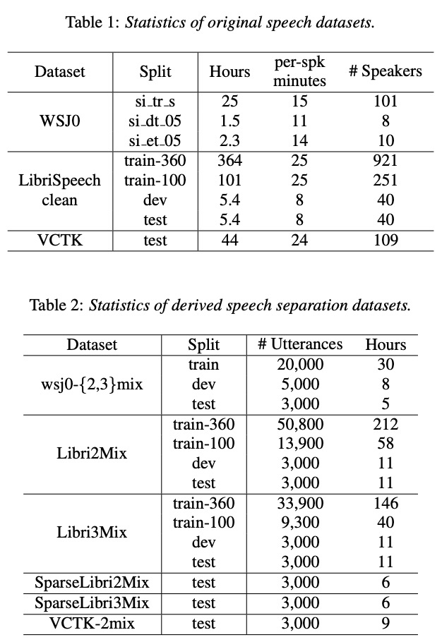
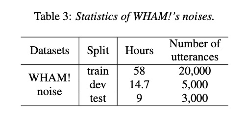
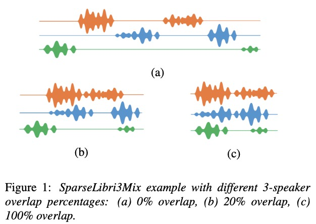
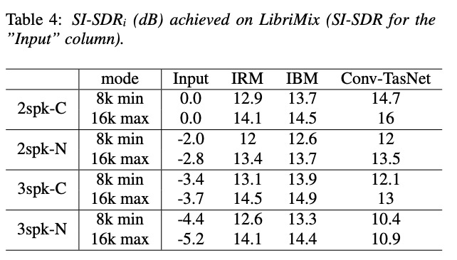
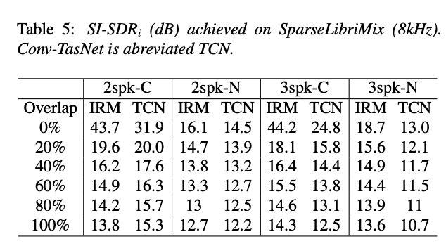
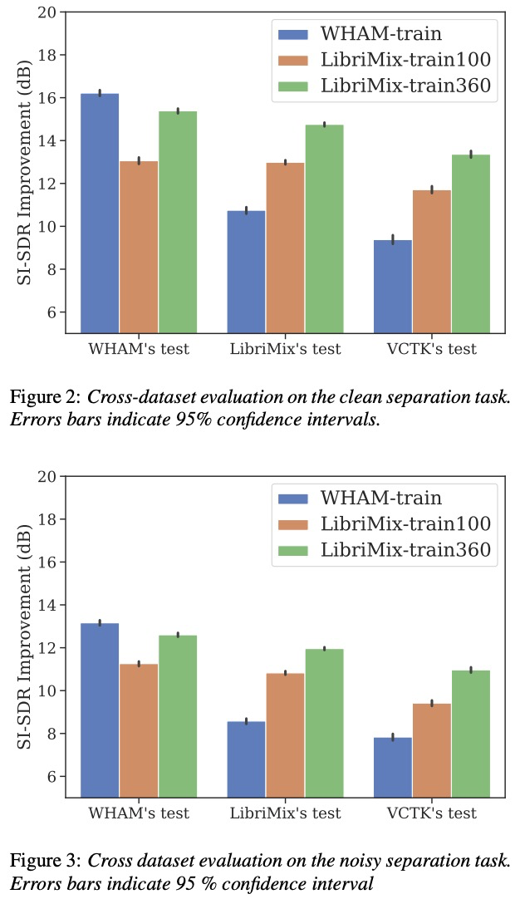

## LibriMix

## 2 Datasets

在下文中，我们介绍了来自《华尔街日报》（WSJ0）的现有语音分离数据集，并介绍了我们来自LibriSpeech的新数据集。关于原始语音数据集和由其衍生的语音分离数据集的统计数字可分别在表1和表2中找到。

### 2.1 WSJ0, wsj0-2mix and WHAM!

WSJ0数据集设计于1992年，是一个用于自动语音识别（ASR）的新语料库[25]。它由《华尔街日报》的阅读语音组成。它是用一个近距离交谈的森海塞尔HMD414麦克风以16kHz的频率录制的。wsj0-2mix数据集[2]使用WSJ0的三个子集：si_tr_s、si_dt_05和 si_et_05，它们都来自WSJ0的5k词汇部分。这代表了119位发言人约30小时的语音。表1报告了子集内说话人和小时分布的细节。
wsj0-2mix数据集由一个训练集、一个验证集和一个测试集组成。训练集和验证集共享来自si_tr_s子集的单个发言人，测试集由si_dt_05和si_et_05组合而成。 语音混合图是由不同发言人的语料对以随机信噪比（SNR）混合产生的。信噪比是在0到5dB之间均匀划定的。数据集有四种变化，分别对应两种不同的采样率（16kHz和8kHz）和两种模式（最小min和最大max）。在最小模式下，混合语音以最短的语词停止。在最大模式下，最短的语词被填充到最长的语词中。对于三个说话人的混合语音，wsj0-2mix的等价物被称为wsj0-3mix，以类似的方式生成[2]。注意，为了生成更多的混合语音，WSJ0的语料在三个子集中被多次使用。每个语料最多重复15次，平均为4次。
在WHAM！数据集中，wsj0-2mix被扩展为包括噪声语音混合音频。在咖啡馆、餐馆和酒吧录制的噪声样本被添加到混合物中，使最大声的说话者和噪声之间的信噪比从-6到+3dB不等。该数据集遵循与wsj0-2mix相同的结构，有相同的四个变化和三个相同的子集。除了在干净（sep clean）和嘈杂（sep noisy）条件下的分离之外，还可以考虑其他增强任务。关于噪声持续时间的统计数字可以在表3中看到。
WHAM！噪音已经在CC BY-NC 4.0许可证下发布，但WSJ0和衍生数据是专有的（LDC）。请注意，wsj0-3mix的无噪音版本已被发布。

### 2.2 LibriSpeech, LibriMix and sparse LibriMix

LibriSpeech[23]是一个基于LibriVox audiobooks的阅读ASR语料库。 为了避免参考信号的背景噪声，我们只使用LibriSpeech的train-clean-100、train-clean-360、dev-clean和test-clean子集。这代表了大约470小时的语音，来自1,252个发言人，有60k的词汇量。更多的统计数据见表2。
我们提出从Lib-riSpeech和WHAM！的噪音中得到一个新的数据集，我们称之为LibriMix。这些数据集是完全开源的。
两个主要的数据集，Libri2Mix和Libri3Mix，包括干净的和有噪音的，两个和三个扬声器的混合物。Libri2Mix遵循与WHAM！完全相同的结构，并允许同样的任务。与LibriSpeech的组织结构一样，它们有两个训练集（train-100, train-360），一个评估集（dev）和一个测试集（test）。为了覆盖LibriSpeech的train-360子集而不重复，如[26]所述，训练噪声样本被以0.8和1.2的系数进行速度扰动。我们没有像wsj0-2mix那样依靠信号功率来衡量单个语料，而是依靠相对于满刻度的响度单位（LUFS）[27]，以dB表示。基于ITU-R BS.1770-4建议[27]，LUFS测量音频信号的感知响度。与典型的信噪比相比，LUFS与人类的感知更好地相关，是静音不变的，而且对降采样不敏感。
语音混合物是通过随机选择不同说话人的语料而产生的。每个话语的响度在-25和-33LUFS之间均匀采样。然后将响度均匀分布在-38和-30LUFS之间的随机噪声样本加入到语音混合物中。如果需要的话，噪声混合物将被剪切到0.9。得到的信噪比为正态分布，在干净的条件下，平均值为0分贝，标准偏差为4.1分贝，在嘈杂的条件下，平均值为-2分贝，标准偏差为3.6分贝。
请注意，在train-100和train-360中，每个语料只使用一次。对于设计和测试，同样的程序被重复了足够多的次数，以达到3,000种混合物。这导致了大约280小时的噪声语音混合物，而WHAM！则为45小时。在LibriMix的训练集中，说话者的种类要多得多，大约有1000个不同的说话者，而在WHAM! 独特的单词总数也更多，LibriMix有6万个独特的单词，而wsj0-2mix只有5千。
为了使对话更加真实，我们还发布了LibriMix的两个和三个发言人的测试集的稀疏重叠版本。我们把这些数据集称为稀疏Libri2Mix和稀疏Libri3Mix。对于每个混合物，我们首先对说话人的身份进行采样，然后，对于每个说话人，我们从test-clean中选择一个语料。在所选语料中循环往复，我们不断增加子语料，其边界是用蒙特利尔强制对齐器（Montreal Forced Aligner MFA）[28]获得的，直到达到最大长度15秒。这个混合过程确保了每个说话者都能说出有语义的语音，这对未来的ASR实验很重要。我们使用与非稀疏版本相同的响度分布，但我们对每个子口音进行了采样。这样就可以改变混合物中的主导发言人[6]。
对于两个和三个发言人的版本，我们在六个不同的语音重叠量下产生了500个混合物。0%、20%、40%、60%、80%和100%。对于三个说话人的混合物，我们计算三个说话人的重叠量，而不是总的重叠量，因为两个说话人的重叠量也是比较高的。请注意，这些重叠率反映了每个子语篇与前面的语篇的重叠量。因为子语料没有相同的长度，混合物的实际重叠率较低，正如LibriMix和WHAM！的最大版本所发生的那样。
由于WHAM！的噪声样本平均较短，最大的混合长度被限制为15秒，以便获得合理数量的样本进行测试。这种稀疏重叠的语料的例子可以在图1中看到。

### 2.3 VCTK and VCTK-2mix

我们还发布了VCTK-2mix，这是一个源自VCTK[24]的无可比拟的开源测试集。VCTK包括109个以英语为母语的人阅读报纸。由于VCTK语料中含有大量的沉默，我们使用基于能量的语音活动检测，以20dB的阈值去除沉默的部分。
VCTK-2mix的混合程序与LibriMix的程序相同。噪声样本也取自WHAM！的测试集。由此产生的数据集包含了约9小时的语音，有来自108个发言人的3000个语料。

## 3 Results

为了评估使用我们新近重新租赁的LibriMix数据集所能达到的结果，我们使用在Asteroid[29]7中实现的Conv-TasNet的最佳配置来完成分离任务。训练是通过在3 s的片段上最大限度地提高包络不变、标度不变的信噪比（SI-SDR）[21, 30]来完成的，批量大小为24，Adam[31]作为优化器。所有的实验都以完全相同的参数进行。由于SI-SDR对于无声源来说是未定义的，所有最大版本的报告结果对应于在相应的最小版本上训练的模型。

### 3.1 Results on LibriMix

表4报告了Conv-TasNet在Libri2mix和Libri3Mix的干净和嘈杂版本上取得的结果，并与短时傅里叶变换（STFT）赢余大小为32ms的理想二进制掩码（IBM）和理想比率掩码（IRM）进行比较。Conv-TasNet是在training-360上训练的，这导致了比training-100更好的性能。结果以相对于输入混合物的SI-SDR改进（SI-SDRi）来报告。我们把干净的双声道分离任务称为2spk-C，把有噪声的任务称为2spk-N，等等。我们看到，对于双声道混合物，Conv-TasNet在干净的条件下优于理想掩码，在嘈杂的条件下与之持平，如[4, 32]。然而，对于三个说话人的混合物，无论是否有噪声，甲骨文的性能仍然遥不可及。

### 3.2 Results on SparseLibriMix

我们在表5中报告了SparseLibri2Mix和SparseLibri3Mix的8kHz测试集在干净和嘈杂条件下的结果。我们使用与表4相同的8kHz模型，这些模型是在非稀疏LibriMix上训练的。可以看出，对于两声道和三声道的混合物，重叠度越高，SI-SDRi越低，这在[6]中也有所体现。在100%重叠的情况下，我们得到的结果与表4中的非稀疏、8kHz min版本的结果相似。这里的数值略高，因为混合物没有被截断到最短的语料。有趣的是，我们看到Conv-TasNet在较小的重叠部分表现得比IRM差。这表明，在稀疏重叠的混合物的声源分离方面仍有改进的余地。

### 3.3 Dataset comparisons

[11]中的实验表明，在wsj0-2mix上训练的模型对其他数据集的泛化能力不强。与[11]类似，我们研究了在不同数据集上训练Conv-TasNet的泛化能力。我们在WHAM！train、LibriMix train-100和train-360上训练了六个不同的Conv-TasNet模型，在干净和嘈杂的条件下。我们在Libri2Mix、WHAM！和VCTK2Mix的相应（干净或嘈杂）测试集上评估了每个模型。图2和图3分别显示了清洁和噪声条件下的结果。请注意，三个噪声测试集的噪声样本是匹配的。对于干净和嘈杂的分离，我们可以看到WHAM！训练的模型对LibriMix的概括性很差，与LibriMix训练的模型相比，SI-SDR下降了4dB，而LibriMix训练的模型在WHAM！测试集上获得了更接近WHAM！训练的模型的表现，SI-SDR仅下降了0.8dB。在VCTK-2mix的干净和嘈杂版本上，WHAM！训练的模型比在Librimix的train-360上训练的模型性能要低3-4dB。与LibriMix的train-360相比，在LibriMix的train-100上训练的模型性能普遍下降，这再次证实了数据量是更好的泛化的关键，而WHAM！中可用的数据量是不够的。总的来说，这些结果表明，LibriMix的清洁和噪声版本比wsj0-mix和WHAM！数据集的泛化效果更好。
有几个因素可以影响泛化。虽然VCTK-2mix生成的统计量与LibriMix中的统计量相匹配，但我们认为这不是原因，因为[11]中报告的结果与此方向一致。相反，我们认为说话人的数量（100对900），词汇量的大小（5k对60k），录音条件（同一房间同一录音材料对不同的房间和材料）和训练数据的总量（30小时对212小时）加起来解释了用LibriMix的train-360训练的模型提供更好的泛化。
[11]中报告的结果与我们这里报告的结果有些不同，这可以由几个因素来解释。首先，[11]中基于VCTK的双声道测试集是使用[2]中的Matlab脚本设计的。这些脚本没有删除沉默，并根据信号功率而不是LUFS来计算信噪比。由于VCTK的语料中可能充满了沉默，这大大增加了混合语料的有效信噪比范围。例如，在一个长沉默中的短语与一个没有沉默的长语混合在一起，可以产生一个混合物，其中第二个来源几乎听不见。这解释了[11]中VCTK的低性能。第二，替代的训练和测试集是基于LibriTTS[16]，它本身是由LibriSpeech[23]衍生出来的。LibriTTS的语料更短、更干净，这可以解释[11]中在其测试集上报告的更高的性能，以及在wsj0-2mix的测试集上测试时性能的较大下降。

