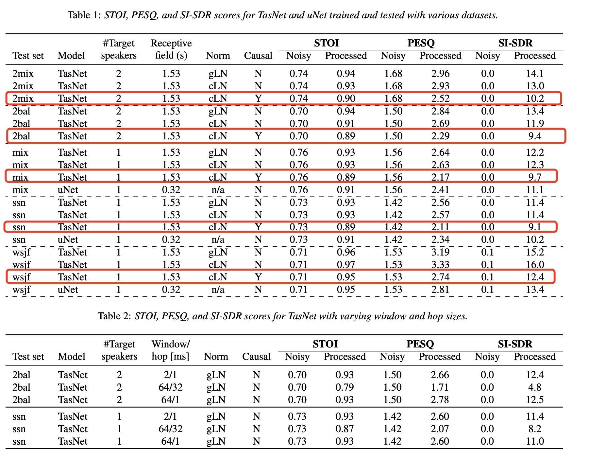

# On TasNet for Low-Latency Single-Speaker Speech Enhancement

## abstract

近年来，主要由于深度学习的复兴，语音处理算法有了巨大的进步。这对于语音分离来说尤其如此，时域音频分离网络（TasNet）已经带来了显著的改进。然而，对于具有明显重要性的单人语音增强的相关任务，TasNet架构是否同样成功还不得而知。在本文中，我们展示了TasNet在语音增强方面也取得了最先进的改进，并且在调制噪声源（如语音）方面取得了最大的收益。此外，我们表明TasNet学习了一种有效的内域表示(inner domain representation)，其中目标和噪声信号成分是高度可分离的。这对于干扰语音信号的噪声来说尤其如此，这可能解释了为什么TasNet在分离任务上表现如此出色。此外，我们表明TasNet在大帧跳动时表现不佳，并猜测混叠可能是造成这种性能下降的主要原因。最后，我们表明TasNet的性能一直优于最先进的单声道语音增强系统。

## Single-Channel Speech Enhancement and Separation

单通道语音分离的目的是将混合信号分离成其组成部分，而只需获得混合信号的单麦克风录音。令$x_i \in \mathbb R^L$表示第i个无噪声时域纯净语音的L个样本，$v \in \mathbb R^L$表示附加的噪声信号，则混合语音信号$y \in \mathbb R^L$可以表示为$y=\sum_{x_i}^I + v$。令I=1，分离任务就归结为语音增强任务的特殊情况。

在这项研究中，考虑了两种深度学习架构，如图1所示；TasNet架构和uNet架构。

本工作中使用的TasNet实现（改编自[20]）有三种主要配置。1）非因果卷积和全局层规范化（gLN），2）非因果卷积和累积层规范化（cLN），以及3）因果卷积和cLN。第一种配置是非因果的，因为整个信号被用于gLN。第二种配置引入了一个固定的系统延迟，因为非因果卷积需要一个信号提前量，这取决于核的长度。第三种配置的延迟是由帧跳决定的，对于大多数实验来说是1毫秒。采用[6]中介绍的符号，我们使用TasNet的以下配置。L16, K8, N512, X8, R3, B128, H512, P3，除非另有明确说明。在这种配置下，TasNet模型有350万个参数和15,310个样本的接受域。关于实施和进一步的细节，我们参考了[6，20]。

[20] J. Wu, “funcwj/conv-tasnet,” Jan. 2021, original-date: 2018-12-27T13:24:39Z. [Online]. Available: https://github.com/funcwj/conv-tasnet

