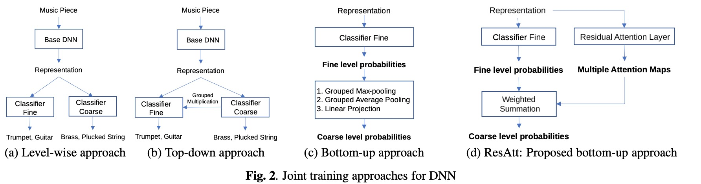

# 一种基于注意力的层次化多标签乐器分类方法

虽然音乐通常是多标签的，但是许多工作已经研究了具有简化设置（例如单标签数据）的分层音乐标签。此外，缺乏一个框架来描述多标签环境下的各种联合训练方法。为了讨论以上问题，本文引入了层次化多标签乐器分类任务。该任务提供其中假设多乐器真实音乐数据的现实设置。在深度学习和传统技术融合的背景下，总结和探索了联合训练DNN的各种分层方法。为了在多标签环境下有效地进行联合训练，提出了两种方法来建模细、粗标签之间的连接，一种方法使用基于规则的分组最大池，另一种方法使用数据驱动方式获得的注意机制。实验结果表明，该方法优于未进行联合训练的方法。此外，所提出的方法中的决策过程可以通过可视化注意图或参考固定规则来解释。

## 1 Introduction

多标签音乐标签是一项分类任务，其目标是预测给定音乐作品的多个语义标签。标签可以表明音乐的流派、情绪和乐器。因此，这项任务对音乐推荐或音乐检索等应用是有意义的。以树状结构组织的音乐标签，即图1所示的层次结构，呈现了领域知识（什么样的标签在音乐上是相关的），带来了包括改进标签性能的好处[1, 2, 3, 4]。虽然音乐标签数据集通常有一个扁平的层次结构[5, 6, 7, 8]，但在音乐信息检索领域，人们对层次化标签的兴趣越来越大[9]。
有几项工作已经解决了层次化音乐标签的问题。Parmezan等人使用传统的机器学习方法研究了层次化的流派分类，而没有使用深度学习[10]。一些作品在简化的问题设置下研究了基于深度神经网络（DNN）的分层方法。例如，Garcia等人解决了单一乐器数据的少量乐器分类问题[11]，而Nolasco等人研究了单音符数据的乐器表示学习[12]。对于层次化的多标签音乐标签任务，Krause等人报告了几个基于DNN的层次化的歌唱活动检测方法[13]。他们的许多讨论都致力于训练独立的DNN，而不是联合训练这些DNN。
虽然真实的音乐通常是多声部和多乐器的，但许多工作都是用简化的数据来解决层次化的音乐标签。因此，基于DNN的分层音乐标签在现实的问题设置下还没有得到广泛的讨论。此外，还缺乏一个框架来描述多标签设置下的各种联合训练方法。虽然使用多个独立的模型是有效的，但DNN已经被证明能够在联合训练中学习层次信息[1, 2, 3, 4, 11, 12]。
在本文中，我们用单一DNN的联合训练方法来解决分层多标签音乐标签的问题。为了研究分层多标签音乐标签，我们介绍了多标签乐器分类任务，它涉及到以2级层次组织的乐器。本文的贡献如下。首先，该任务提供了一个更现实的场景，我们处理的真实音乐通常是多声部、多乐器和不同类型的。其次，我们在一个类似于传统分层方法分类的框架下，对DNN的各种联合训练方法进行了分类和探索，以促进对深度学习和传统技术融合的进一步探索。最后，为了在多标签环境下进行有效的联合训练，我们提出了ResAtt和分组最大池化（GMP），用于应用剩余注意力层或最大池化操作来模拟细级和粗级标签之间的联系。

## 2 Related Work

在音频领域，现有的分层分类研究主要集中在声音事件检测（SED）任务上。在[1]中，粗级和细级标签之间的联系被表述为分组求和集合。该表述要求细级预测通过softmax激活进行归一化，这主要是针对单标签任务。Zharmagambeto等人将DNN与决策树相结合[4]，鼓励DNN学习包含层次信息的表示。然而，在推理阶段使用了一个单独的分类器，所以分类器没有被层次信息所优化。
Nolasco等人在Nsynth数据集[14]中研究了乐器的分层度量学习[12]（单个乐器的单音）。[11]在几张照片的学习设置下解决了一个多音版本的乐器任务，单乐器数据取自MedleyDB数据集[15]的干音轨。在过滤掉不够精细的标签（如 "鼓"）后，根据音乐世界中使用的乐器分类法[16]，诱导出层次结构。这个想法启发我们将我们自己的音基层次结构（如图1所示）引入我们的实验中使用的数据集。
分层多标签音乐标签在[13]中就歌唱活动检测进行了讨论。损失项被引入，以建立单个DNN所做的粗略预测和精细预测之间的联系，从而提高检测性能。[13]中还介绍了一个描述各种基于DNN的分层方法的框架，然而，许多研究都致力于单独的多模型方法，而不是联合训练这些模型。

## 3. PROPOSED METHODS

令基础DNN提取的$N_{dim}$维的音乐片段信息表示为$Z^{N_{dim}}$，然后将其通过sigmoid激活函数的分类起投影到细粒度概率，$P_{fine} \in \mathbb R^{N_{fine} * 1} $。二元分类是通过使用标签的阈值将$P_{fine}$转换为二元分类来进行的。假设有一个2级（细/粗）的层次结构。

### 3.1 Hierarchical Approachesfor Joint Training

我们在本文中的主要重点是联合训练一个DNN进行分层多标签分类。我们首先总结了各种相关的方法，类似于[13, 17]中描述的传统分层技术的分类，并展示了深度学习如何与传统技术相结合。

层次化的方法。传统上，为层次结构中的每一层准备一个模型[17, 13]。这个想法已经适应了[13]中的联合训练框架，它可以被说明为图2（a）中的结构。尽管这种方法有助于基础DNN学习层次信息，但分类器在训练期间仍然是独立的。在[13]中，引入了两个损失项来优化这些具有层次信息的分类器。

自上而下的方法。按照惯例，首先训练一个模型来对粗大的标签进行分类，然后在每个粗大的标签处准备单独的模型来对其子（细级）标签进行分类[17, 10, 13]。我们把它概括为 "先粗后细"。为了适应这种方法来联合训练DNN，我们在基础DNN之后连接一个类似于[4]的简化软决策树（SDT）[18]。在SDT中，细级概率是叶子节点与其父节点（粗级概率）的乘法[18]，在图2（b）中被称为粗级标签与其子细级标签的分组乘法。由于假设是多标签任务，SDT中的softmax激活被sigmoid取代。与[4]不同的是，我们使用SDT进行推理，因为SDT在训练期间被联合优化。然而，在自上而下的方法中，在粗略层次上出现的错误很难纠正，这可能会影响其精细层次的性能[13]。

自下而上的方法。在传统的自下而上的方法中，只有一个非层次的（扁平）模型是用细级标签训练的。
在推理过程中，粗略的标签是通过用预先定义的规则聚合细级别的预测来预测的[13, 17]。我们将其概括为 "先细后粗"。传统的自下而上方法的核心问题是，模型没有与 "自下而上的规则 "共同优化，导致非最佳性能。另一个主要缺点与自上而下的方法类似，细级错误会传播到粗级[13, 17]。
自下而上聚合的一个常见规则是，当一个细级标签被分配给一个音乐样本时，父级的粗级标签也会被分配给该音乐，例如，如果一个音乐样本被注释为 "长笛"，它就会被注释为 "木管"。我们将这一规则称为分组最大池化（GMP），因为该规则相当于将最大池化应用于不同组的子细级别标签。显然, 分层数据集中的细级和粗级标签也满足同样的规则[11, 13, 19].

我们强调自下而上的联合训练方法的概念，即DNN与聚合规则共同优化。基于数据集中的细级和粗级标签满足类似于最大集合规则的事实，我们建议在训练过程中应用GMP（图2（c）），将数据集中的层次结构告知DNN，并提高标签性能。

### 3.2 ResAtt: Attention-based Bottom-up Method

我们还提出了ResAtt，它通过注意力机制来模拟精细级和粗略级标签之间的联系。ResAtt可以使用具有0-100%估值的元素的注意图来告诉系统哪些细级标签对于特定的粗级标签是重要的，哪些是不重要的。这个想法的灵感来自于这样的见解：最大集合等于产生一个0/1的二进制注意图的操作，从输入向量中选择出最重要的元素。因此，所提出的两种方法都可以理解为基于注意力的方法。
