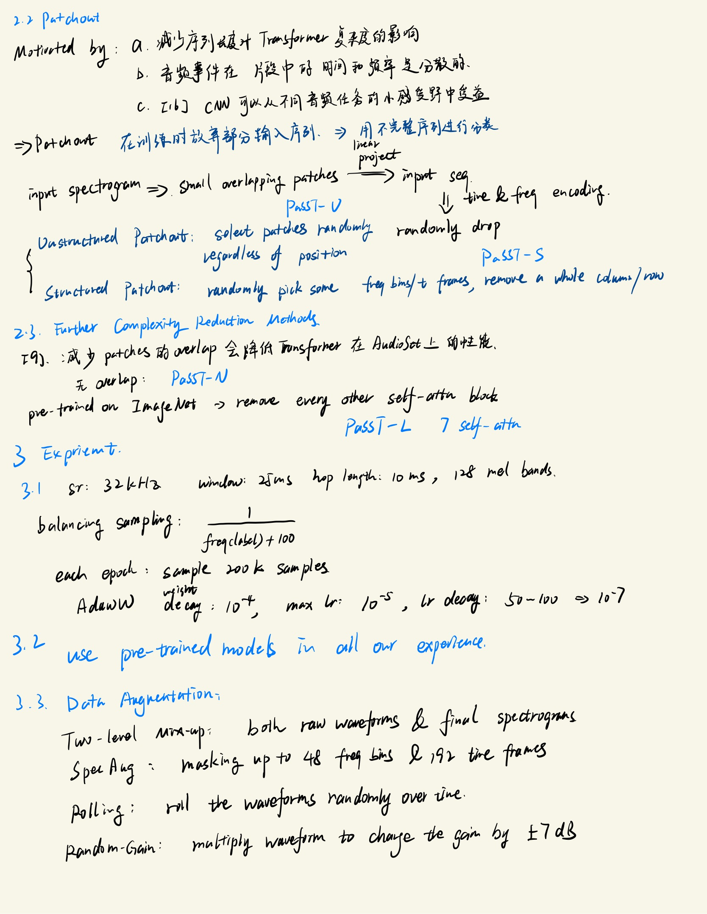

https://github.com/kkoutini/PaSST
## Data augmentation

### Two-level Mix-Up

raw waveform mixup: `class MixupDataset` in `esc-50/dataset.py`
spec mixup: `from helpers.mixup import my_mixup` in `ex_esc50.py`:

```python
if self.use_mixup:
    rn_indices, lam = my_mixup(batch_size, self.mixup_alpha)
    lam = lam.to(x.device)
    x = x * lam.reshape(batch_size, 1, 1, 1) + x[rn_indices] * (1. - lam.reshape(batch_size, 1, 1, 1))
```

### SpecAugment

in `class AugmentMelSTFT` in `model/preprocess.py`:

```python
self.freqm = torchaudio.transforms.FrequencyMasking(freqm, iid_masks=True)
self.timem = torchaudio.transforms.TimeMasking(timem, iid_masks=True)
```

### Rolling

`def get_roll_func` in `esc-50/dataset.py`

### Random Gain

`def pydub_augment` in `esc-50/dataset.py`
`def get_ir_sample` in `esc-50/dataset.py`: convolve Impluse Response

## Note


