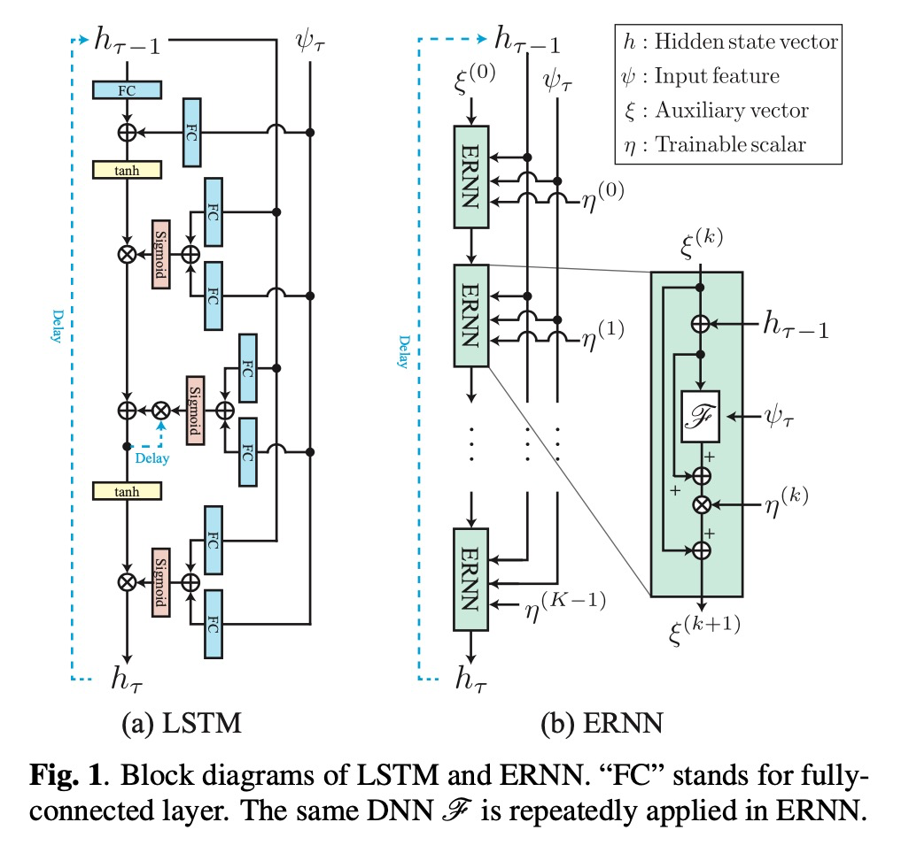
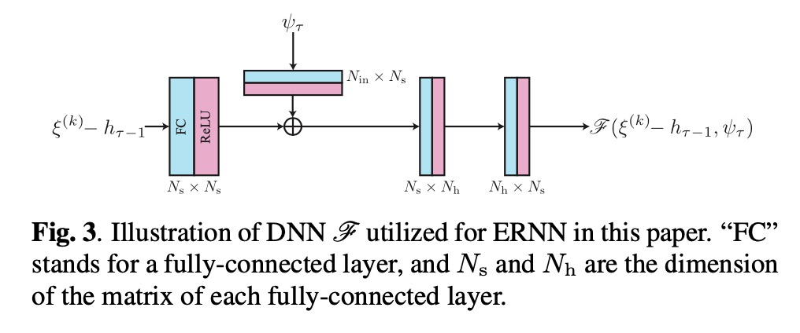

# ERNN

ERNN是一种RNN，它通过跳过连接和重复应用相同的块来避免消失/编码梯度问题[24]。它的灵感来自于常微分方程的隐式离散化方案的固定点递归。通过引入一个中间变量ξ(k)，迭代指数k=0,...,K-1，ERNN的简单形式可以写为

ξ(k+1) = ξ(k) +η(k)[F(ψτ,ξ(k) +hτ−1)−(ξ(k) +hτ−1)], (10)

其中η(k)是一个可训练的小标量，K是迭代的总次数，初始值ξ(0)通常为0，更新的状态向量hτ是迭代的结果hτ=ξ(K)，即ERNN在K迭代后根据输入ψτ和hτ-1返回hτ，如公式（5）。这里，F是一个由神经网络实现的非线性函数，这使得公式（10）成为一个多层RNN，如图1（b）。
ERNN的显著特性是其梯度在理想情况下不会消失或爆炸[24]。也就是说，梯度的规范等于1：∥∂hc/∂hp∥=1（p<c）。因此，预计ERNN可以学习长期的依赖关系，而不会受到训练问题的影响，因为梯度在所有时间实例的参数更新中都会存在。这一特性应该允许我们简化网络，因为LSTM中使用的门控单元对于减轻训练的难度不再是必要的。我们在下一节的实验中表明，一个参数少得多的简单的ERNN可以与LSTM竞争。

