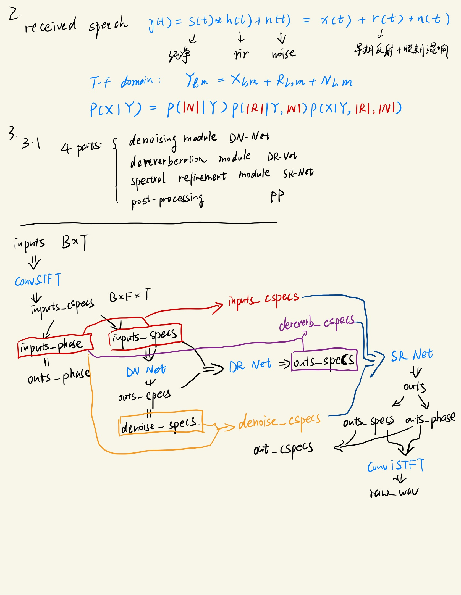

# PercepNet

A Perceptually-Motivated Approach for Low-Complexity, Real-Time Enhancement of Fullband Speech

https://zhuanlan.zhihu.com/p/462629950

该模型同时使用卷积层（1x5 层，然后是 1x3 层）和 GRU [19] 层，如图4所示。卷积层在时间上对齐，以便在未来使用多达 M 帧。 为了实现 40 毫秒的前瞻，包括 10 毫秒的重叠，我们使用M=3。

https://www.cnblogs.com/LXP-Never/p/15679428.html

我们展示了一种有效的语音增强算法，该算法关注语音谱包络和周期性的主要感知特征，以实时生成低复杂度的高质量全频带语音。所提出的PercepNet模型使用带结构来表示频谱，以及基音滤波和额外的包络后滤波步骤。评估结果显示，宽带和全频带语音质量都有显著改善，并证明了基音滤波和后滤波的有效性。我们相信结果证明了使用感知相关参数建模语音的好处

# SDD Net

https://github.com/IMYBo/SDDNet

首先，与理想的(i)STFT不同，由于域变换系数是以数据驱动的方式学习的，它们通常对真实的声学环境表现出相对较差的概括能力。另外，已经说明，在T-F域中，噪声和语音成分往往更容易被单独区分[12]。此外，我们注意到，在以前的深度噪声抑制（DNS）挑战中，基于T-F域的方法通常表现出更好的平均意见得分（MOS）。

3.1

图1(a)显示了拟议的框架图。它由四个部分组成，即去噪模块（DN-Net）、去混响模块（DR-Net）、光谱细化模块（SR-Net）和后处理（PP）模块。DN-Net和DR-Net都是在幅值域中运行的，即我们首先将复数频谱解耦为幅值和相位，只处理幅值，相位保持不变。第二阶段后，我们将处理后的幅度和原来的噪声相位耦合起来，重新生成粗略的复数频谱。对于SR-Net来说，它同时接收原始和粗复频谱，并进一步细化幅度和相位方面的频谱细节。请注意，与隐含地从头开始重新生成频谱不同，引入了一个全局残差连接，以强制网络只关注缺失的细节而不是整体的频谱分布。在SR-Net之后，尽管前几个阶段的性能很好，但由于DNN的非线性效应和数据集的不匹配，在非活动区域仍然存在一些残余噪声，所以引入了一个后处理模块来进一步抑制失真，这也验证了对主观质量的好处。

3.2

由于卷积编码器解码器拓扑结构在SE应用中具有良好的性能[20, 21, 22]，我们在前三个模块中采用了它。由于DN-Net和DR-Net都是在幅值域运行的，因此只利用一个解码器来恢复幅值。对于SR-Net，与[8]类似，我们采用两个解码器来估计实部和虚部（RI）。以DN-Net为例，DN-Net的图示如图1（b）所示。编码器由五个区块组成，每个区块包括一个卷积层、InstanceNorm（IN）和PReLU。对于解码器来说，它是编码器的镜像版本，每个卷积层都被去卷积层所取代，以恢复原始大小。利用跳过连接来减轻映射过程中的信息损失。核大小、跨度和通道数被定义为k、s和C，其数值在图中列出。第i层的特征大小在通道、时间和频率轴上分别格式化为（Ci, L, Fi）。人们可以发现，我们保持时间分辨率不变，这保证了因果关系的实现。为了捕捉长期的时间依赖性，我们在瓶颈处插入级联的时间卷积模块（TCM）[10]。为了减少参数，我们选择了挤压版本[15, 16]，即S-TCM，其中特征大小首先被压缩为64，而不是文献[10]所说的512，然后再进行扩张卷积。对于每个阶段，我们堆叠三组TCM，每组包括6个S-TCM，扩张率d={1, 2, 4, 8, 16, 32}。
对于DN-Net和DR-Net，假设最后一层的输出被表示为|M˜ q |∈（I，L，F），q∈{dn，dr}。I表示滤波器的长度，在本文中我们将其设定为5。然后，我们进行多帧（MF）过滤，以利用相邻帧之间的相关性[23].

3.3

凭借先进网络拓扑结构的强大性能，语音质量可以得到明显改善。然而，一些残留的噪音仍然存在。其原因可以归结为两个方面。首先，由于数据驱动的特性，DNNs的性能通常是有限的。因此，当声学场景未经训练时，其性能将不可避免地下降，导致一些可闻的残余噪声。其次，网络通常是高度非线性的。在实际环境中，由于非线性效应，可能会出现不自然的失真。

受[24]的启发，我们利用一种低复杂度的方法作为后处理模块，进一步抑制第三级输出的残余噪声。具体来说，我们采用轻量级网络[24]来获得增益函数，该函数作为语音存在概率（SPP）的估计值来递归估计噪声功率谱密度（NPSD）。有了估计的NPSD，MMSE-LSA估计器[25]被用来计算最终的增益，然后用于抑制残余噪声。此外，我们还采用了一个基于倒频谱的预处理方案，在估计NPSD之前抑制谐波成分[26]。因此，在大多数情况下，NPSD的过度估计问题可以得到缓解。

# Complex Ratio Mask

# DCCRN: Deep Complex Convolution Recurrent Network for Phase-AwareSpeech Enhancement

1. 动机
   卷积循环网络（CRN）集成了卷积编码器-解码器（CED）结构和长短期记忆（LSTM），已被证明有助于复杂目标，为了更有效地训练复杂目标，在本文中提出了一种新的网络结构称为深度复杂卷积循环网络（DCCRN）。
2. 方法
   本文提出的DCCRN网络架构优化了 SI-SNR 损失。该网络有效地结合了 DCUNET 和 CRN 的优点，使用 LSTM 对时间上下文进行建模，显着降低了可训练参数和计算成本。

